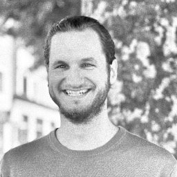

## Hello World 👋

My name is Daniel Göller, I am about to finish my degree in data science working on a thesis on <abbr title="Natural Language Processing">NLP</abbr>. My pronouns are (the paradigms of) _he_ and _they_. Nice to meet you! 🤗

🎓 Currently, I am working on my thesis. It is an <abbr title="Natural Language Processing">NLP</abbr> project on German texts from the 18th century. A large collection of texts from the Austrian enlightenment is to be analysed. To get an overview of what people wrote about, different <abbr title="Named Entity Recognition">NER</abbr> frameworks and models are compared. The best performing one will then be fine-tuned either on a corpus of texts of the same period to improve the language model, or on a small annotated dataset of named entities of the text basis to improve the <abbr title="Named Entity Recognition">NER</abbr>. This would require labour-intensive manual annotation, though. The project could be extended to named entity linking with databases from libraries.

▶️ [Have a look at my CV](/cv/) for details on what I've been doing in my life so far.

🤙 I am always interested in working on new projects, acquiring knowledge, connecting and finding out what other people (= you) are doing. So, [do get in touch](/me/say-hi).

よろしくお願いいたします。
